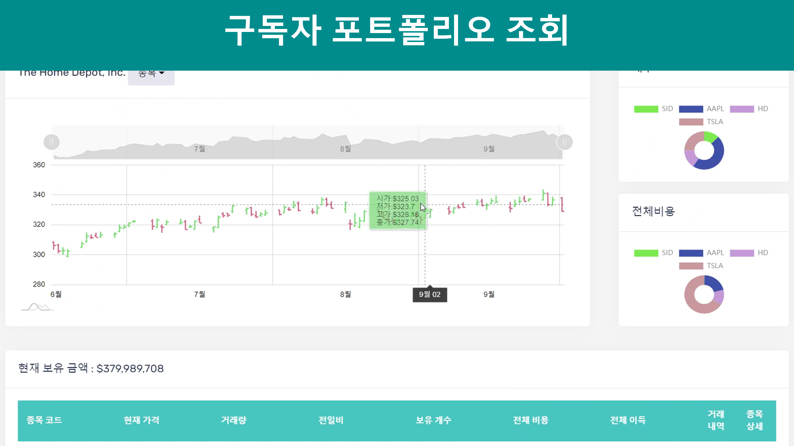

# 하나윈스톡 : 실시간 인공지능 WTS

[프로젝트 홈페이지](https://koposoftware.github.io/2021_14_hmjung/)

# 1. 프로젝트 개요

주식시장을 이기려면 빠른 정보력이 필요합니다. 실시간 차트, 인공지능 예측, 편리한 소통 시스템을 활용해서 사용자에게 최대한 빠르게 정보를 전달하고 최대 이익을 주는 WTS 플랫폼을 개발하고자 프로젝트를 기획했습니다. 키움 증권 등 다양한 증권 플랫폼에서 AI 자산 관리 기능이 제공되지만, 주가를 직접 예측하는 기능은 없습니다. 차별화된 서비스를 제공하고자 AI가 직접 주가까지 예측하는 서비스를 기획 했습니다.

# 2. 프로젝트 제안서
   
초기 하나 윈스톡 주제 선정 및 제안 발표 자료 입니다.
 
[제안발표자료](발표자료/프로젝트주제발표_정해명.pdf)  

# 3. 프로젝트 결과

## 실시간 주가 차트 페이지
   
   
## AI 주가 예측 페이지
      

## 구독자 포트폴리오 페이지
      

## 주식 채팅 페이지
    

## AI 관리 보드 페이지
   
     
## 기능 리스트
   
   

## 시스템 아키텍처
   

## 데이터 흐름도
   
   
   
## ERD
   
   
## 응용 기술
   
   
## * 개발환경
- OS : Window10, Linux CentOS
- Framework : Flask Framework, Spring Framework 4, Mybatis
- Server : Flask Server, Apache Tomcat9
- Language : Python, Java(jdk-1.8), Javascript, HTML, CSS
- IDE Tools : Eclipse, Sqldeveloper, atom
- DB : Oracle 11g
- Library : Keras, Tensorflow, Pandas, Spring WebSockets, amcharts, jQuery, iQuery-UI, JSTL, Bootstrap-4.3.1   

## 발표 pdf 
   [발표자료](/발표자료/최종프로젝트_정해명_발표자료.pdf) 

## 시연 동영상 
   
   

# 4. 본인 소개

|이름 |정해명||
|연락처 | hmchung2(@)gmail.com|
|skill set| Frontend - HTML, CSS, Javascript|
| | Backend - Java, Spring, Oracle, Python, C++, R|
|수상| 서울특별시 빅데이터 공모전 우수상 |
|경력|  T3Q 백엔드 API 개발 1년  |
|프로젝트| 1. 공군기상단 기상 이상 탐지 시스템 개발|
||2. 자동 법률 문서 추천 프로그램 개발 |

   
 
