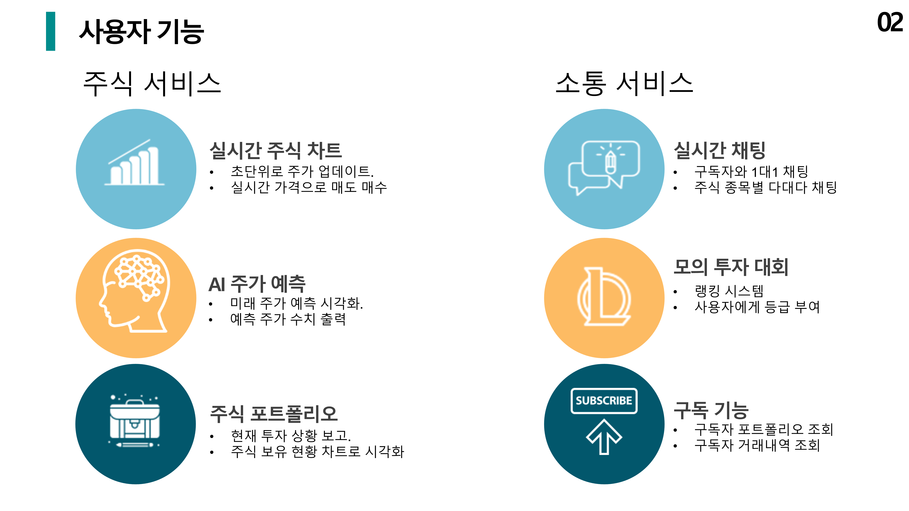
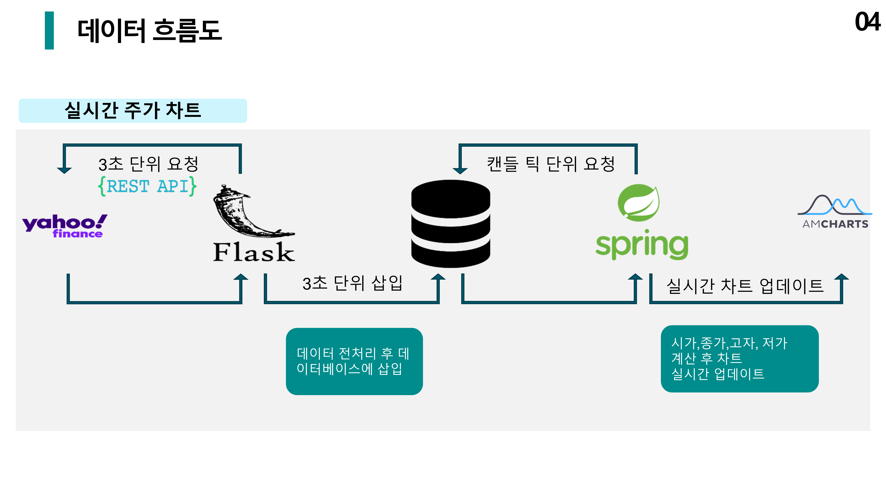
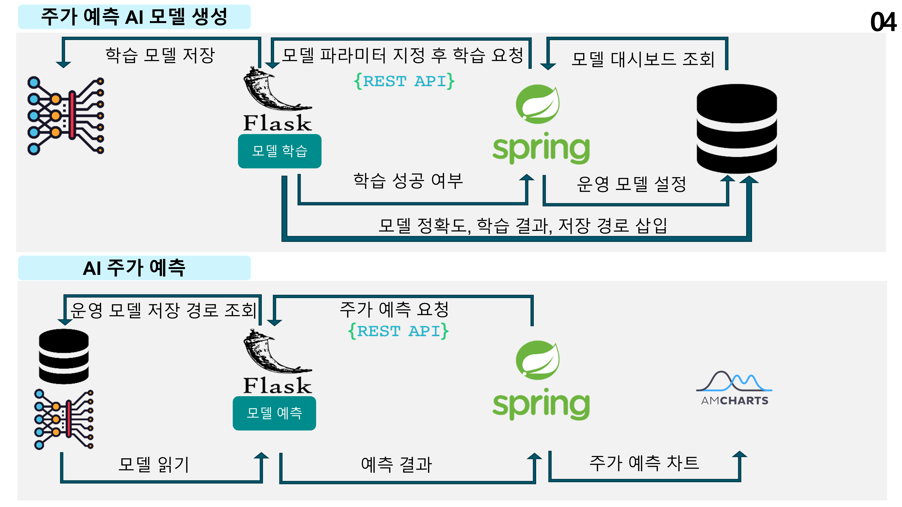

# 프로젝트 제목

[프로젝트 홈페이지 - https://koposoftware.github.io/template/](https://koposoftware.github.io/template/)

# 1. 프로젝트 개요

주식시장을 이기려면 빠른 정보력이 필요합니다. 제가 생각하는 주식 정보 매체는 실시간 차트, AI 서비스 그리고 주식 커뮤니티 활성화입니다. 이 3가지 기능을 모두 갖추어서 투자자들에게 이익을 주는 WTS 플랫폼을 개발하고자 프로젝트를 기획했습니다. 키움 증권 등 다양한 증권 플랫폼에서 AI 자산 관리 기능이 제공되지만 주가를 직접 예측하는 기능은 없습니다. 차별화된 서비스를 제공하고 초 단위로 주가 정보가 업데이트되고 AI 모델이 미래 주가를 예측하고 실시간으로 언제든지 소통할 수 있어서 주식 초보자들도 조언을 듣고 편하게 금융 라이프를 즐길 수 있는 WTS 플랫폼을 개발했습니다.      

# 2. 프로젝트 제안서

## 사용자 기능
   
   
## 관리자 기능
   
   
## 아키텍처
   
   
## 데이터 흐름도
   
   
   
## ERD
   
   
## 응용 기술
   

   [발표자료](/project.pptx) 
   <iframe id="ytplayer" type="text/html" width="640" height="360" src="https://www.youtube.com/embed/6LxbdIjWP04" frameborder="0"></iframe>
 

# 3. 프로젝트 결과

## 발표 ppt 
   [발표자료](/project.pptx) 

## 시연 동영상 

   <iframe id="ytplayer" type="text/html" width="640" height="360" src="https://www.youtube.com/embed/6LxbdIjWP04" frameborder="0"></iframe>

# 4. 본인 소개

본인 소개를 추가하세요

|이름 |정해명||
|연락처 | gdko(@)kopo.ac.kr|
|skill set| Frontend - HTML, CSS, Javascript|
| | Backend - Java, Spring, Oracle|
|자격증|  |
|수상| |
|특기사항|  TOEIC 990 |

# 5. 기타
그외 프로젝트를 더욱 설명할수 있는 것들을 추가하세요

# 홈페이지 설정
 본인 repository에서 "Setting"를 들어가서 GitHub Pages에서 설정 변경.
* Source
 Source에서 원하는 branch와 directory 설정한다. 
 기본값은 master 에 root를 설정 
 Save 버튼 꼭 누른다.
 
 * Theme Chooser
 theme을 변경하여 좀더 이쁜 홈페이지를 만든다.
   
    
   
 
